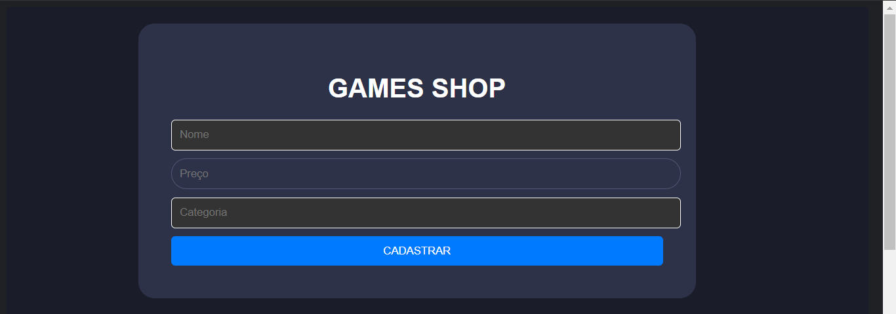
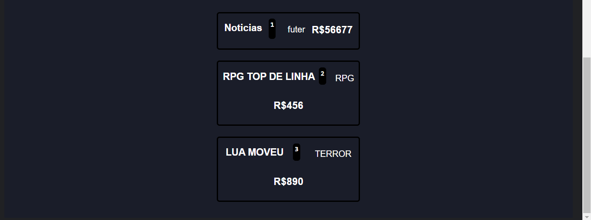
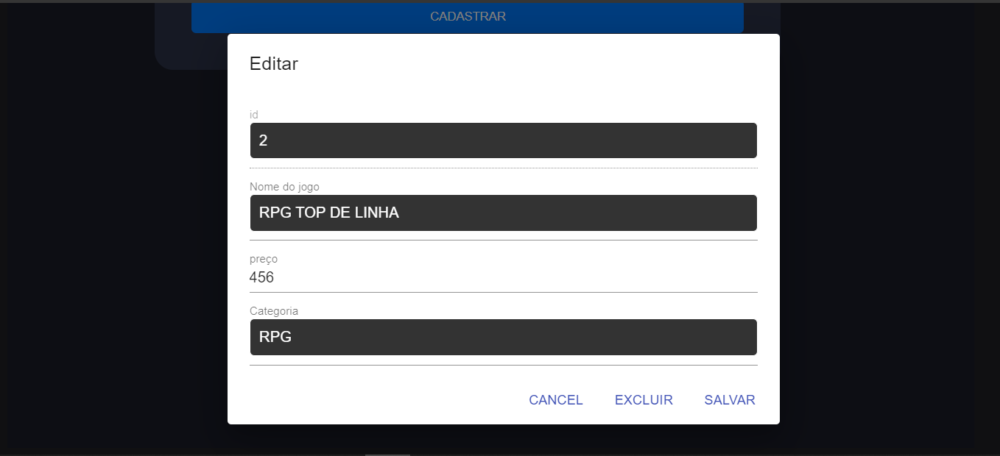
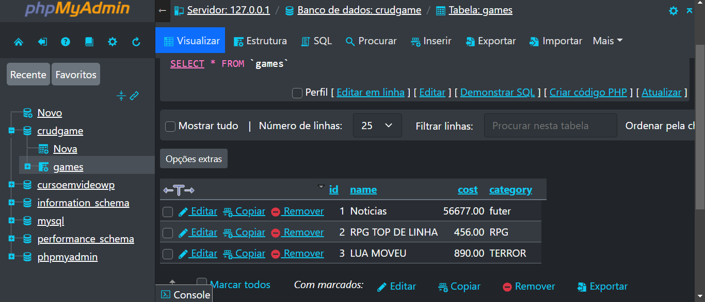

# LOJA DE JOGOS COM REACT
👨‍🏫FORMULARIO DE JOGOS COM REACT, EXPRESSJS E MYSQL.

 <br> 
 <br> 
 <br> 
 <br> 

## DESCRIÇÃO:
Este é um aplicativo de backend desenvolvido em Node.js com o uso do framework Express e banco de dados MySQL. Ele fornece endpoints para realizar operações CRUD (Create, Read, Update, Delete) em uma entidade de jogos de vídeo.

## RECURSOS:
1. **Registro de Novo Jogo**:
   - O endpoint `/register` permite registrar um novo jogo no banco de dados. O usuário pode fornecer o nome do jogo, o custo e a categoria através do corpo da requisição POST. Os dados são inseridos na tabela `games` do banco de dados MySQL.

2. **Pesquisa de Jogos**:
   - O endpoint `/search` possibilita pesquisar jogos com base no nome, custo e categoria. O usuário pode fornecer um ou mais parâmetros de pesquisa no corpo da requisição POST. O aplicativo retorna os jogos que correspondem aos critérios de pesquisa especificados.

3. **Recuperação de Todos os Jogos**:
   - O endpoint `/getCards` recupera todos os jogos armazenados no banco de dados MySQL. Os dados são retornados como uma resposta JSON.

4. **Edição de Jogo Existente**:
   - O endpoint `/edit` permite editar um jogo existente no banco de dados. O usuário deve fornecer o ID do jogo a ser editado, bem como os novos valores para o nome, custo e categoria no corpo da requisição PUT. Os dados do jogo são atualizados na tabela `games`.

5. **Exclusão de Jogo**:
   - O endpoint `/delete/:id` permite excluir um jogo com base no seu ID. O usuário deve fornecer o ID do jogo a ser excluído como parte da URL da requisição DELETE. O jogo correspondente é removido da tabela `games` no banco de dados.

## EXECUTANDO O PROJETO:
1. **Configuração do Banco de Dados:**
   - Antes de executar o site, é necessário importar o arquivo `DATABASE.sql` que está no diretório `CODIGO/server`. Se não estiver familiarizado com o processo de importação, [confira este curso](https://github.com/VILHALVA/CURSO-DE-MYSQL) para orientações detalhadas.

2. **Configuração do PHP:**
   - Abra o arquivo `index.js` em `CODIGO/server/index.js` e ajuste as configurações do banco de dados:
   ```javascript
   host: "localhost",
   user: "seu_usuario",
   password: "sua_senha",
   database: "crudgame",
   ```

3. **Instalar as dependências do projeto**:
   - Execute o comando nos diretórios `CODIGO/client` e `CODIGO/server`:
     ```cmd
     npm install
     ```
   Este comando instala todas as dependências listadas no arquivo `package.json` do seu projeto. 

4. **Executando o Aplicativo:**
   - Para subir o servidor, no diretório `CODIGO/server`, abra Terminal/CMD e digite o seguinte comando:
   ```bash
   npm rum devStart
   ```
   - Agora abra outro Terminal/CMD no diretório `CODIGO/client` e digite o seguinte comando:
   ```bash
   npm start
   ```
   - Acesse o APP no navegador visitando `http://localhost:3001/`.

5. **Usando o APP**:
   - **Cadastro de Jogo:**
      - Na parte superior do aplicativo, você verá um formulário com campos para inserir informações sobre um jogo, como nome, preço e categoria.
      - Preencha os campos necessários com as informações do jogo que você deseja cadastrar.
      - Após preencher os campos, clique no botão "Cadastrar".

   - **Lista de Jogos:**
      - Abaixo do formulário de cadastro, você verá uma lista de jogos cadastrados.
      - Cada jogo na lista terá um título, preço, categoria e opções de edição/remoção.
      - Você pode visualizar todos os jogos cadastrados nesta lista.

   - **Edição de Jogo:**
      - Para editar um jogo existente, clique em algum componente da lista do jogo que você deseja modificar.
      - Um formulário de edição será exibido, permitindo que você altere as informações do jogo, como nome, preço e categoria.
      - Após fazer as alterações desejadas, clique no botão "Salvar" para confirmar as alterações.

   - **Exclusão de Jogo:**
      - Para excluir um jogo existente, clique no botão "Excluir" ao lado do jogo que você deseja remover.
      - Um aviso de confirmação será exibido para garantir que você realmente deseja excluir o jogo.
      - Clique em "OK" para confirmar a exclusão do jogo, ou "Cancelar" para voltar atrás.

   - **Visualização Atualizada:**
      - Após realizar qualquer ação de cadastro, edição ou exclusão de jogos, a lista de jogos será atualizada automaticamente para refletir as mudanças feitas.
      - Isso garantirá que você tenha uma visão atualizada e precisa dos jogos cadastrados no sistema.

## NÃO SABE?
- Entendemos que para manipular arquivos em `HTML`, `CSS` e outras linguagens relacionadas, é necessário possuir conhecimento nessas áreas. Para auxiliar nesse aprendizado, oferecemos cursos gratuitos disponíveis:
* [CURSO DE HTML E CSS](https://github.com/VILHALVA/CURSO-DE-HTML-E-CSS)
* [CURSO DE NODEJS](https://github.com/VILHALVA/CURSO-DE-NODEJS)
* [CURSO DE REACT](https://github.com/VILHALVA/CURSO-DE-REACT)
* [CURSO DE MYSQL](https://github.com/VILHALVA/CURSO-DE-MYSQL)
* [CONFIRA MAIS CURSOS](https://github.com/VILHALVA?tab=repositories&q=+topic:CURSO)

## CREDITOS:
- [PROJETO CRIADO PELO "vitorLostadaC"](https://github.com/vitorLostadaC/React-JS--Crud-Mysql)
- [VEJA OS VIDEOS DESSE PROJETO:](https://www.youtube.com/@VitorCunhaCode)
   - [PARTE 1](https://youtu.be/e0He6sCiQT8?si=eg8-T6D0n3oo4Djo)
   - [PARTE 2](https://youtu.be/5_9rvyT9cg4?si=4euk96V6T6uBYOkC)
   - [PARTE 3](https://youtu.be/vzPsUWLprAw?si=dM7vwVCT3CwRDpO1)
- [PROJETO FEITO PELO VILHALVA](https://github.com/VILHALVA)


